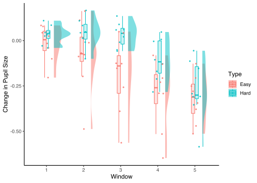
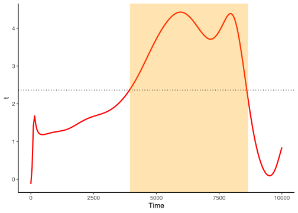

# Summary

The study of pupil dilation, or pupillometry, has undergone a considerable revival in recent years.
Early research noted substantive changes in pupil dilation due to mental effort [@Hess1964; @Kahneman1969; @Kahneman1973]; however, this method has seen a surge in usage following a rise in the popularity of automatic eye-tracking technology coupled with the search for more robust methods in psychological science [@vanderWel2018; @Winn2018]. Pupillometry, measured using automated eye-tracking technology, thus provides a methodology that is cheaper than most neuroimaging techniques, but more powerful than many behavioural measures, such as overall looking time measurements common to eye-tracking experiments.

Despite these considerable advantages when compared to other paradigms, the details of the actual methods and pipelines involved with pupillometry have been a topic for much debate [@Mathot2018; @vanRij2019].
These methodological differences are mostly attributable to two causes.
The first, is that the *nature* of pupillometric studies require careful design and procedure.
Pupil dilation is highly sensitive to not just luminance, but also other properties of the experiment, including gaze position due to stimuli locations [@Gagl2011], as well as stimuli-specific considerations such as brightness or location on the screen, and participant-specific considerations, such as the stress levels and memory load.
In this way, the very nature of any pupillometric study demands careful planning on design, and thoughtful consideration about the details of the methods.
The second such cause of the variable methods in pupillometric studies stems from the analytical decisions made in the processing of the data.
Due to many researchers following either closed, in-house analytical pipelines, or open-source pipelines that require costly software, or particular equipment at some point in the analysis, there has been a lack of consensus on the analytical decisions to be made in processing.
These decisions include how to filter and clean the data [@Jackson2009], decisions to be made on baselining the data [@Mathot2018], and whether to take time-course or aggregate pupil size forward as a variable [@vanRij2019].
Thus PupillometryR aims to assist experimenters by providing a clear pipeline which is both free and open-source, an available for usage with most common brands of eye-tracker.

# Implementation

`PupillometryR` extends a suggested pipeline for implementation of pupillometric studies [@Jackson2009], making heavy use of the `signal` package [@signal2014] for pre-processing of the pupil data. The in-built plotting functions, designed for ease of use, rely on `ggplot2` [@Wickham2016] for the data visualisation, and include raincloud plots [@Allen2019] as an in-built data visualisation option. For analysis several options are given, including the use of Generalised Additive Models which uses the `mgcv` package [@Wood2017], and Functional Data Analysis, which uses functions from the `fda` package [@Ramsay1997].

Some comprehensive pupillometry pipelines exist already in MATLAB [@Hershman2019; @SiroisPupillometryWalkthrough], and in R [@Geller2019], and while each of these have their own merits, none offer the start-to-finish comprehensive pipeline in an open-source language compatible with most brands of eye-tracker, which includes in-built plotting functions, and flexibility of analysis style (time windows, FDA, GAMs) offered in `PupillometryR`. In addition, `PupillometryR` is available on CRAN, making it easy to download for R users, and subject to regular CRAN checks.

# Acknowledgements

This package benefitted greatly from discussions with and past work made available by Sylvain Sirois and advice from Mihaela Duta and Jacolien van Rij. I am also grateful to David Robinson for assistance with the implementation of raincloud plots in the package, and Micah Allen and the raincloud plots team for making the raincloud plot technique available.

# References
